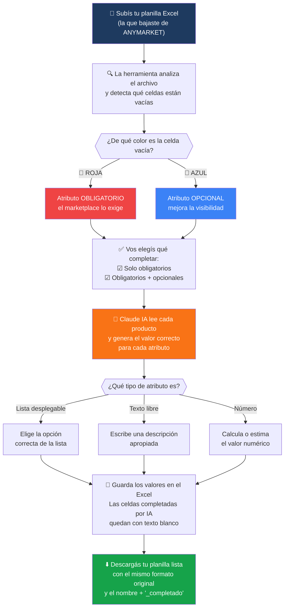

# ANYattributes 🚀

> **Completa automáticamente los atributos de tus productos en ANYMARKET usando Inteligencia Artificial.**

Olvídate de llenar manualmente cientos de celdas en tu planilla Excel. ANYattributes lee tu archivo, detecta qué atributos faltan y los completa por vos con IA — en minutos.

---

## ¿Qué hace esta herramienta?



---

## Antes de empezar — Lo que necesitás

| Requisito | Para qué sirve |
|-----------|----------------|
| **Node.js 18+** | Correr la aplicación web |
| **Python 3.8+** | Procesar los archivos Excel |
| **Una API Key de Anthropic** | Para que la IA complete los atributos |

> No sabés qué es Node.js o Python? Pedile a alguien técnico que te ayude con la instalación inicial. Una vez configurado, cualquiera lo puede usar.

---

## Instalación — Paso a paso

### Paso 1 — Bajá el proyecto

```bash
git clone https://github.com/MauroLandivar/ANYattributes.git
cd ANYattributes
```

### Paso 2 — Instalá las dependencias

```bash
# Dependencias de la aplicación web
npm install

# Dependencias de Python (para leer/escribir Excel)
pip3 install openpyxl
```

### Paso 3 — Configurá tu API Key de Anthropic

1. Entrá a [console.anthropic.com](https://console.anthropic.com/) y creá una cuenta
2. Generá una API Key
3. Copiá el archivo de ejemplo:

```bash
cp .env.local.example .env.local
```

4. Abrí `.env.local` con cualquier editor de texto y reemplazá `sk-ant-...` con tu API Key real:

```
ANTHROPIC_API_KEY=sk-ant-TU-CLAVE-AQUI
```

### Paso 4 — Iniciá la aplicación

```bash
npm run dev
```

Luego abrí tu navegador en: **http://localhost:3000**

---

## ¿Cómo usarla?

### 1. Subí tu planilla

Arrastrá tu archivo `.xlsx` o `.xls` a la zona de carga (o hacé click para buscarlo).

> La planilla debe ser la que bajaste de ANYMARKET — con las 4 filas de encabezado y los productos desde la fila 5.

### 2. Revisá el análisis

La herramienta te va a mostrar:
- Cuántos productos encontró
- Cuántos atributos **obligatorios** (celdas rojas) faltan
- Cuántos atributos **opcionales** (celdas azules) faltan

### 3. Elegí qué completar

- ☑ **Solo obligatorios** — Marcado por defecto. Completa lo que el marketplace exige.
- ☐ **Incluir opcionales** — Actívalo si querés completar también los atributos de mejor visibilidad.

### 4. Iniciá el procesamiento

Hacé click en **"Iniciar procesamiento con IA"** y esperá. Vas a ver el progreso en tiempo real.

> ⏱ El tiempo depende de cuántas celdas tenga que completar. Aproximadamente 2 segundos por celda.

### 5. Descargá tu planilla

Cuando termine, hacé click en **Descargar**. El archivo se llama igual que el original + `_completado`.

---

## Cómo identificar qué completó la IA

Las celdas que la IA completó tienen el **texto en color blanco** (sobre el fondo rojo o azul original). Así podés revisarlas fácilmente en Excel.

---

## Preguntas frecuentes

**¿Mis datos se guardan en algún servidor?**
No. Todo el procesamiento ocurre en tu computadora. Los archivos solo se guardan temporalmente en `/tmp` mientras dura la sesión.

**¿Qué pasa si la IA se equivoca en algún valor?**
Siempre revisá los valores antes de subirlos a ANYMARKET. La IA hace su mejor esfuerzo, pero un ojo humano final es importante.

**¿Funciona con cualquier planilla de ANYMARKET?**
Sí, mientras tenga el formato estándar: 4 filas de encabezado y datos desde la fila 5.

**¿Cuánto cuesta usar la IA?**
El costo depende de tu plan en [Anthropic](https://console.anthropic.com/). Claude Opus 4.6 cuesta $5/millón de tokens de entrada y $25/millón de salida. Para planillas medianas (100 productos, 10 atributos) el costo típico es menor a $0.50.

---

## Tecnologías utilizadas

- **Next.js 15** — Aplicación web
- **Claude Opus 4.6** (Anthropic) — Motor de IA para completar atributos
- **Python + openpyxl** — Lectura y escritura de archivos Excel (incluyendo colores de Apache POI)
- **Tailwind CSS** — Diseño visual

---

## Soporte

¿Algo no funciona? Abrí un [issue en GitHub](https://github.com/MauroLandivar/ANYattributes/issues).

---

*Powered by **ANYMARKET** · Desarrollado con Claude AI*
