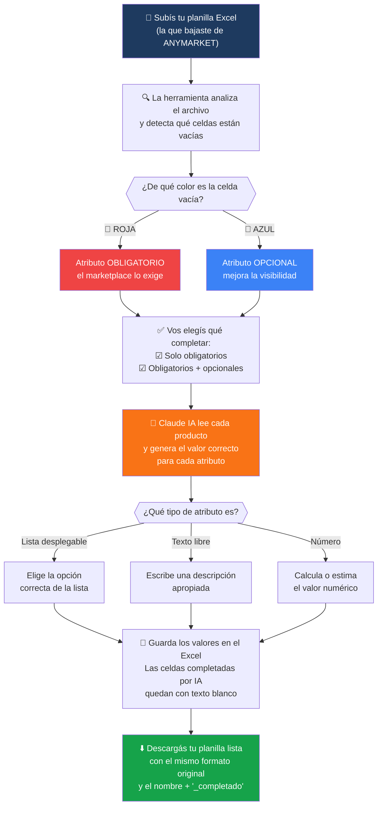

# ANYattributes 🚀

> **Completa automáticamente los atributos de tus productos en ANYMARKET usando Inteligencia Artificial.**

Olvídate de llenar manualmente cientos de celdas en tu planilla Excel. ANYattributes lee tu archivo, detecta qué atributos faltan y los completa por vos con IA — en minutos.

---

## 🌐 Deploy en Railway — URL pública en 5 minutos

**Railway** es la forma más fácil de tener la app corriendo en internet, gratis, con una URL pública que cualquiera puede usar.

### Paso 1 — Creá tu cuenta en Railway

Entrá a [railway.app](https://railway.app) y registrate con tu cuenta de GitHub.

### Paso 2 — Nuevo proyecto desde GitHub

1. En el dashboard, hacé click en **"New Project"**
2. Elegí **"Deploy from GitHub repo"**
3. Seleccioná **`ANYattributes`** de tu lista de repos
4. Railway detecta el `Dockerfile` automáticamente ✅

### Paso 3 — Agregá tu API Key de Anthropic

1. Dentro del proyecto, andá a la pestaña **"Variables"**
2. Hacé click en **"New Variable"**
3. Nombre: `ANTHROPIC_API_KEY`
4. Valor: tu clave de [console.anthropic.com](https://console.anthropic.com/)
5. Guardá

### Paso 4 — Generá tu URL pública

1. Andá a la pestaña **"Settings"** → **"Networking"**
2. Hacé click en **"Generate Domain"**
3. Copiá la URL que te da Railway (algo como `anyattributes-production.up.railway.app`)

¡Listo! Esa URL la podés compartir con cualquier persona. No necesitan instalar nada.

> 💡 **Railway tiene un plan gratuito** con $5 de crédito mensual — más que suficiente para uso moderado.

---

## ¿Qué hace esta herramienta?



---

## Antes de empezar — Lo que necesitás

| Requisito | Para qué sirve |
|-----------|----------------|
| **Node.js 18+** | Correr la aplicación web |
| **Python 3.8+** | Procesar los archivos Excel |
| **Una API Key de Anthropic** | Para que la IA complete los atributos |

> No sabés qué es Node.js o Python? Pedile a alguien técnico que te ayude con la instalación inicial. Una vez configurado, cualquiera lo puede usar.

---

## Instalación — Paso a paso

### Paso 1 — Bajá el proyecto

```bash
git clone https://github.com/MauroLandivar/ANYattributes.git
cd ANYattributes
```

### Paso 2 — Instalá las dependencias

```bash
# Dependencias de la aplicación web
npm install

# Dependencias de Python (para leer/escribir Excel)
pip3 install openpyxl
```

### Paso 3 — Configurá tu API Key de Anthropic

1. Entrá a [console.anthropic.com](https://console.anthropic.com/) y creá una cuenta
2. Generá una API Key
3. Copiá el archivo de ejemplo:

```bash
cp .env.local.example .env.local
```

4. Abrí `.env.local` con cualquier editor de texto y reemplazá `sk-ant-...` con tu API Key real:

```
ANTHROPIC_API_KEY=sk-ant-TU-CLAVE-AQUI
```

### Paso 4 — Iniciá la aplicación

```bash
npm run dev
```

Luego abrí tu navegador en: **http://localhost:3000**

---

## ¿Cómo usarla?

### 1. Subí tu planilla

Arrastrá tu archivo `.xlsx` o `.xls` a la zona de carga (o hacé click para buscarlo).

> La planilla debe ser la que bajaste de ANYMARKET — con las filas de encabezado y los productos desde la fila 6.

### 2. Revisá el análisis

La herramienta te va a mostrar:
- Cuántos productos encontró
- Cuántos atributos **obligatorios** (celdas rojas) faltan
- Cuántos atributos **opcionales** (celdas azules) faltan

### 3. Elegí qué completar

- ☑ **Solo obligatorios** — Marcado por defecto. Completa lo que el marketplace exige.
- ☐ **Incluir opcionales** — Actívalo si querés completar también los atributos de mejor visibilidad.

### 4. Iniciá el procesamiento

Hacé click en **"Iniciar procesamiento con IA"** y esperá. Vas a ver el progreso en tiempo real.

> ⏱ El tiempo depende de cuántas celdas tenga que completar. Aproximadamente 2 segundos por celda.

### 5. Descargá tu planilla

Cuando termine, hacé click en **Descargar**. El archivo se llama igual que el original + `_completado`.

---

## Cómo identificar qué completó la IA

Las celdas que la IA completó tienen el **texto en color blanco** (sobre el fondo rojo o azul original). Así podés revisarlas fácilmente en Excel.

---

## Preguntas frecuentes

**¿Mis datos se guardan en algún servidor?**
No. Todo el procesamiento ocurre en tu computadora. Los archivos solo se guardan temporalmente en `/tmp` mientras dura la sesión.

**¿Qué pasa si la IA se equivoca en algún valor?**
Siempre revisá los valores antes de subirlos a ANYMARKET. La IA hace su mejor esfuerzo, pero un ojo humano final es importante.

**¿Funciona con cualquier planilla de ANYMARKET?**
Sí, mientras tenga el formato estándar de ANYMARKET: fila 2 con nombres de atributos, datos desde la fila 6.

**¿Qué pasa si aparece el modo "sin colores detectados"?**
Algunas planillas usan "colores de tema" de Excel que no tienen valor RGB directo. En ese caso aparece un aviso naranja y podés activar "Procesar todas las celdas vacías" para que la IA complete igual todas las celdas de atributos que estén vacías.

**¿Cuánto cuesta usar la IA?**
El costo depende de tu plan en [Anthropic](https://console.anthropic.com/). Claude Haiku 4.5 (el modelo que usamos) cuesta $1/millón de tokens de entrada y $5/millón de salida. Para planillas de 100 productos con 10 atributos vacíos cada uno, el costo típico es menor a $0.05.

---

## Detalles técnicos

Esta sección es para quienes quieran entender cómo funciona por dentro.

### Detección de colores en planillas de ANYMARKET

Las planillas de ANYMARKET son generadas por Apache POI (una librería Java). Usan una paleta de colores "indexada" de 64 entradas — no guardan el color como código RGB directo sino como un número de índice.

Los dos colores clave:
| Índice | Color | Significado |
|--------|-------|-------------|
| 10 | Rojo `#FF0000` | Atributo obligatorio |
| 48 | Azul cornflower `#3366FF` | Atributo opcional |

La herramienta mapea estos índices a sus valores RGB reales para clasificar cada celda. También incluye un modo alternativo que lee directamente el XML interno del archivo `.xlsx` como fallback.

### Optimización de tokens (costo)

En lugar de hacer una llamada a la IA por cada celda vacía (lo que sería carísimo con cientos de atributos), la herramienta agrupa todos los atributos de un mismo producto y los envía en **una sola llamada**. La IA responde con un JSON con todos los valores juntos.

Esto reduce el costo hasta **30 veces** comparado con el enfoque celda por celda.

### Auto-detección de estructura

La herramienta detecta automáticamente desde qué fila empiezan los datos del producto (buscando la primera fila con ID numérico en columna A), por lo que funciona aunque tu planilla tenga una cantidad diferente de filas de encabezado.

---

## Tecnologías utilizadas

- **Next.js 15** — Aplicación web
- **Claude Haiku 4.5** (Anthropic) — Motor de IA para completar atributos (rápido y económico)
- **Python + openpyxl** — Lectura y escritura de archivos Excel (incluyendo colores de Apache POI)
- **Tailwind CSS** — Diseño visual

---

## Soporte

¿Algo no funciona? Abrí un [issue en GitHub](https://github.com/MauroLandivar/ANYattributes/issues).

---

*Powered by **ANYMARKET** · Desarrollado por Mauro Landivar con Claude AI*
